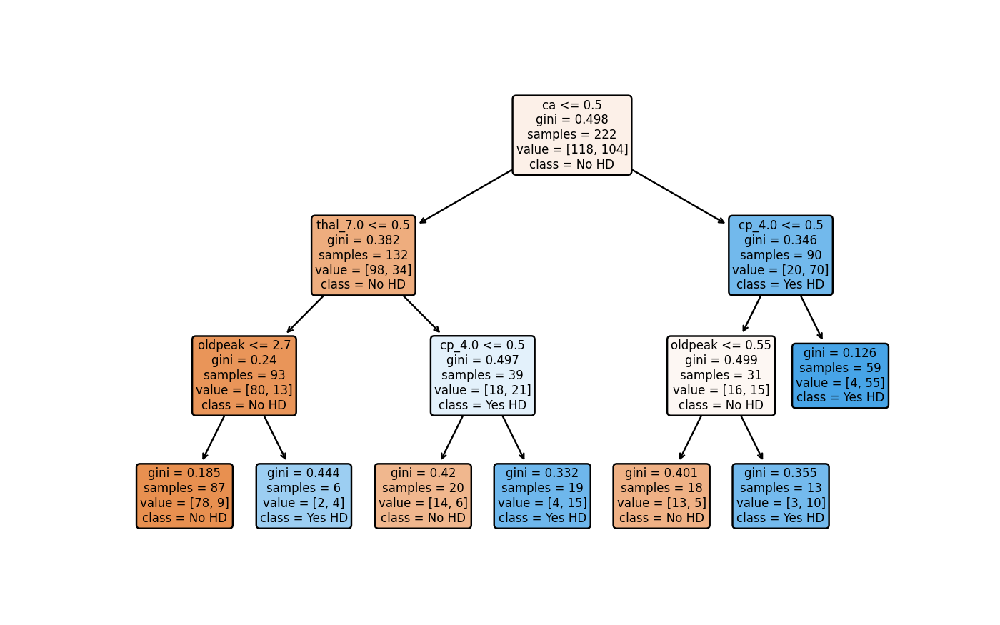
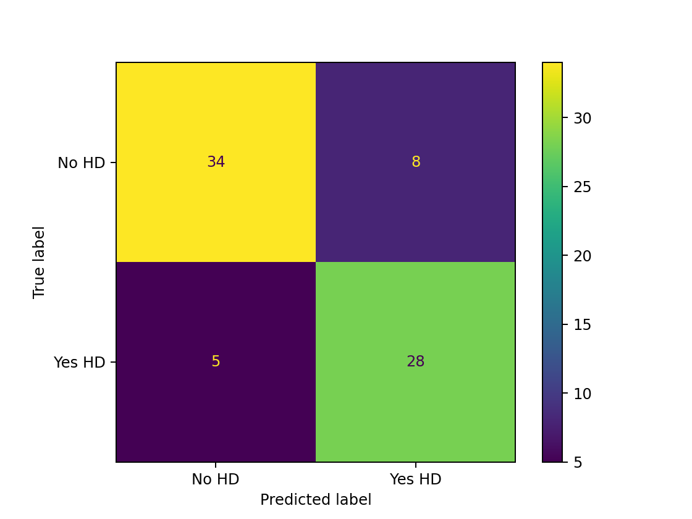

# Decision Tree

With medical dataset doing binary classification with a decision tree to to predict hearth diseases (HD) with scikit-learn

dataset: https://archive.ics.uci.edu/ml/machine-learning-databases/heart-disease/processed.cleveland.data

